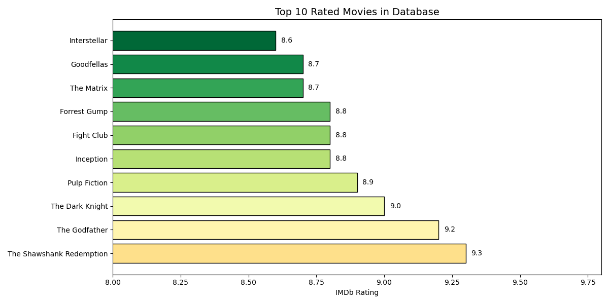
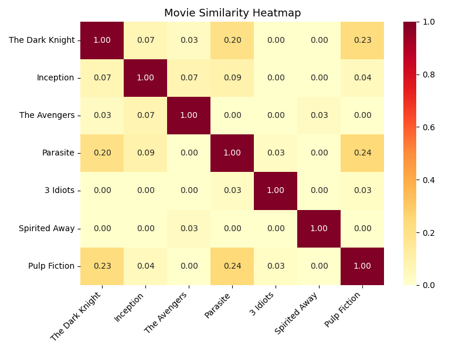

# Movie Recommendation System 🎬

Recommends movies based on content similarity —
the same concept behind Netflix and YouTube recommendations.

## Tools Used
- Python, Pandas, Scikit-learn, Matplotlib, Seaborn

## How It Works
- Combined genre and description into a single feature
- Used TF-IDF Vectorization to convert text into numbers
- Calculated Cosine Similarity between all movie pairs
- Returns top 5 most similar movies for any input

## Sample Output
- Watched The Dark Knight → Recommends Inception, The Matrix
- Watched 3 Idiots → Recommends PK, Dangal, Dil Chahta Hai

## Results

